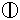
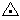
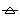
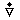
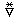

# JMA Library

## References
- [気象庁が提供する天気予報データの読み解き方](https://github.com/misohena/el-jma/blob/main/docs/how-to-get-jma-forecast.org)

##  Weather Code (automatic observed)
[配信資料に関する仕様 No.13301 ～地域気象観測データ～](https://www.data.jma.go.jp/suishin/shiyou/pdf/no13301)

「0 20 212 自動観測による天気」(p.23)
|Code|Symbol|Description|
|:--- | :--- | :--- |
|0|| 晴 |
|1|| 曇 |
|2|| 煙霧 |
|3|| 霧 |
|4|| 降水またはしゅう雨性の降水 |
|5|| 霧雨 |
|6|| 着氷性の霧雨 |
|7|| 雨 |
|8|| 着氷性の雨 |
|9|| みぞれ |
|10|| 雪 |
|11|| 凍雨 |
|12|| 霧雪 |
|13|| しゅう雨または止み間のある雨 |
|14|| しゅう雪または止み間のある雪 |
|15|| ひょう |
|16|| 雷 |
|17-29| N/A | 保留 |
|30| N/A | 天気不明 |
|31| N/A | 欠測 |

Symbol Image: https://www.jma.go.jp/bosai/amedas/img/{_code_}.bmp
